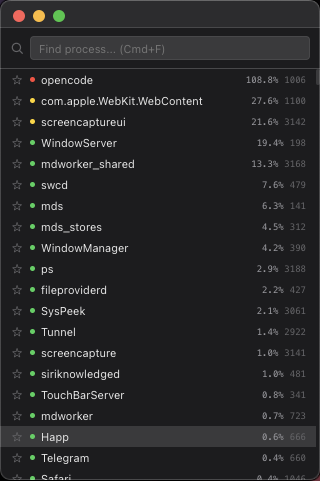
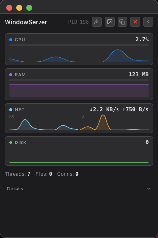

# SysPeek

**Lightweight real-time per-process resource monitor for macOS.**

  

SysPeek is a compact utility that gives you instant visibility into any process on your Mac — CPU, RAM, network throughput, open files, threads, and ports — all in a minimal 320×480 window.

<p align="center">
  
  &nbsp;&nbsp;
  
</p>

## Download

1. Go to [Releases](https://github.com/ask444d/SysPeek/releases)
2. Download the latest `SysPeek.app.zip`
3. Unzip and drag **SysPeek.app** to your Applications folder
4. Launch — no installation or dependencies required

> First launch? Right-click → Open if macOS blocks the app.

## Features

- **Real-time monitoring** — CPU, RAM, network (RX/TX bytes), open files, connections
- **Sparkline charts** — live-updating graphs for each metric
- **Process search** — find any process by name instantly
- **Favorites** — pin frequently watched processes to the top
- **Kill process** — terminate unresponsive processes with confirmation dialog
- **Desktop alerts** — notifications when CPU > 90% or RAM > 1 GB
- **Process details** — expand to see file path, open ports, thread list
- **Export** — save data as CSV, JSON, TXT, or PNG chart snapshot
- **Keyboard shortcuts** — `Cmd+F` search, `Esc` back, `Cmd+Shift+C` copy metrics
- **Native macOS look** — dark/light theme, hidden title bar, compact layout

## Keyboard Shortcuts

| Shortcut | Action |
|----------|--------|
| `Cmd+F` | Focus search |
| `Esc` | Back / close modal |
| `Cmd+Shift+C` | Copy current metrics |

## How It Works

SysPeek collects metrics using native macOS commands (`ps`, `lsof`, `netstat`) — no third-party agents, no background daemons, no admin rights needed. Data is collected once per second and displayed in real time.

## Building from Source

```bash
git clone https://github.com/ask444d/SysPeek.git
cd SysPeek
npm install
npm start
```

Requires Node.js 18+ and macOS.

## Support

If you find SysPeek useful, consider supporting development:

[](https://www.patreon.com/cw/ask444d)

## License

MIT
